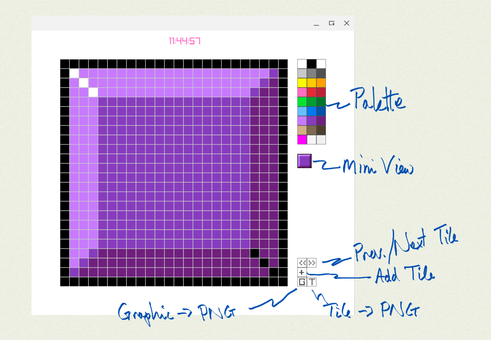

# PixEd - A Really Simple Pixel Art Tile Editor

A dml-based tile editor that's really, really, simple, unlike all the pixel art editors I've looked at so far.

The goal for the app is to be able to create little tiles for use in little games, e.g. a mine in minesweeper or a colored '3D' block in a Tetris tetromino.  You know, really, really, simple stuff.

# Prerequisites
PixEd's harness uses raylib.  The app has been cloned from this repo and compiled on ChromeOS and Windows 10.

---



---

- Set up: `ln -s .../PixEd/run /usr/bin/PixEd`
- Run `PixEd` for default 32x32 tiles with 24x24 pixels
- Run `PixEd <t_res> <p_span>` to set tile resolution and pixel span.
E.g. `PixEd 16 24`
- Caution: if tile resolution is less than 16 then UI gets messy
- Clicking on a color in the palette sets the brush color
- Painting in the tile area sets the pixel colors
- Shift-painting in the tile area sets pixels to the background color, i.e. that's your erase function.
- The top-right color in the palette is '100% transparency'.
- Change the default background color in Harness.dml
- When you hit 'S' the current **tile** is exported to a 'PixEd_HHMMSS.png' file, where HHMMSS is the time.  Rename it to stop it being overwritten.
- When you hit '+' a new tile is appended to the tiles sequence.
- When you hit '<<' or '>>' you go back and forth thru the tiles
- There is no save for the tile set as a whole
- The 'L' and '-' buttons do nothing, atm.
- Repeat after me: simple, simple, simple, simple, simple...
- If you upsize the tile resolution (t_res) to 64x64, you may have trouble fitting it on screen; downsize the pixels (p_span) to get the bigger tiles to fit on screen.

# Requirements, sorta

Editing a 32x32 tile is so quick that lots of the original requirements seem unnecessary.

- [x] Tiles are 16x16.  
- [x] A new Graphic starts with one Tile 
- [x] Tile Pixels can be painted.
- [x] New Tiles can be added.
- [x] A Palette presents the 27 #defined raylib colors in Color wells.  
- [x] A Color has R, G, B and Alpha values.
- [x] Graphics can be exported to PNG files.
- [x] A Brush can be dipped in a Color Well and the Color painted onto the Tile.
- [x] An Eraser erases the Color in pixels, setting them to the background color, with shift-paint.
- [x] The default background is off white.
- [x] A new Tile can be appended to the sequence of existing Tiles.

- [ ] The Palette is saved with the Graphic.
- [ ] The Palette has a Mixer well.
- [ ] The Brush can transfer paint from Color wells to the Mixer well.
- [ ] The Mixer well blends the Colors transferred to it.
- [ ] The Mixer well can be wiped clean.
- [ ] The Mixer well Color can be assigned to a Color well.
- [ ] The top row white, black and transparent Color wells cannot be overridden.  They are always available to adjust the mixer Color brightness and transparency. 
- [ ] The background Color can be set for the Graphic.
- [ ] A new Tile can be created as a copy of an existing Tile.
- [ ] A Tile can be cleared.
- [ ] A Tile can be removed from the Tile sequence.
- [ ] Tiles can be viewed as a Stack, a Strip, or a Grid.

# Domain Outline

```
domain PixelGraphics
{
    object Graphic;
    object Tile;
    object Pixel;
    object ColorWell;
    object Palette;
"---------------------------------------"
    object Harness;
    object Raylib [ archetypes='provided'; ];
"---------------------------------------"
    type Index   : NumericType;
    type Byte    : NumericType;
    type Color   : ProvidedType;
    type Image   : ProvidedType;
    type Boolean : ProvidedType;
    type Name    : TextType;
};
```
